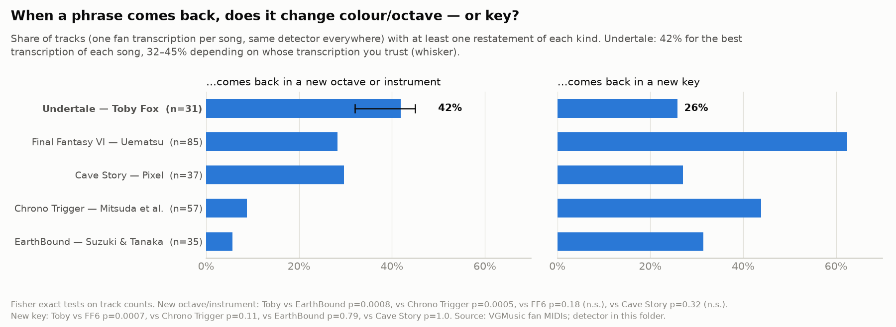
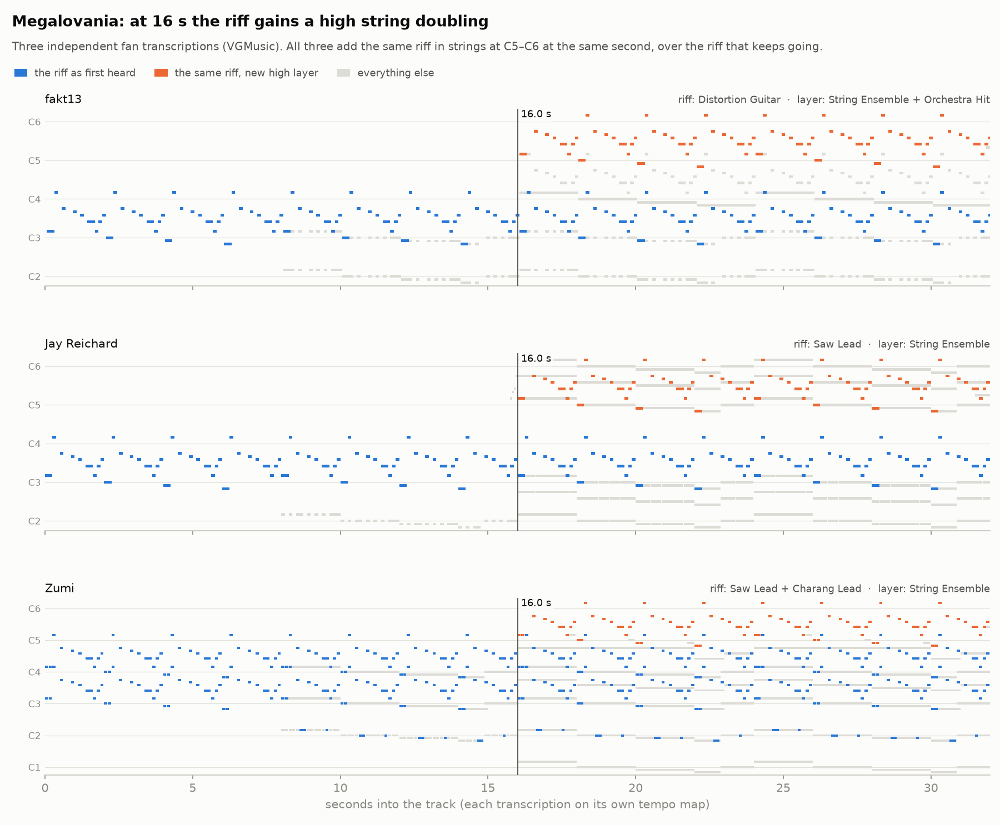
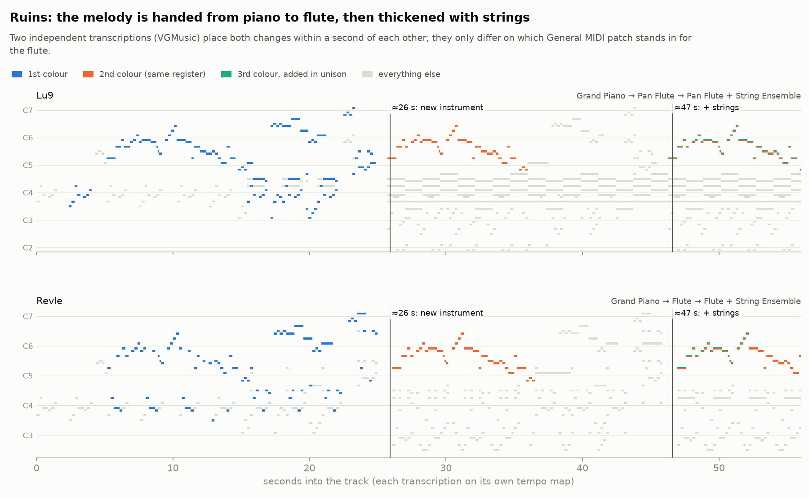
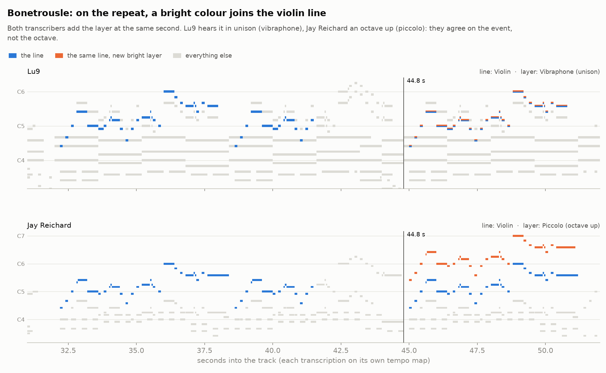
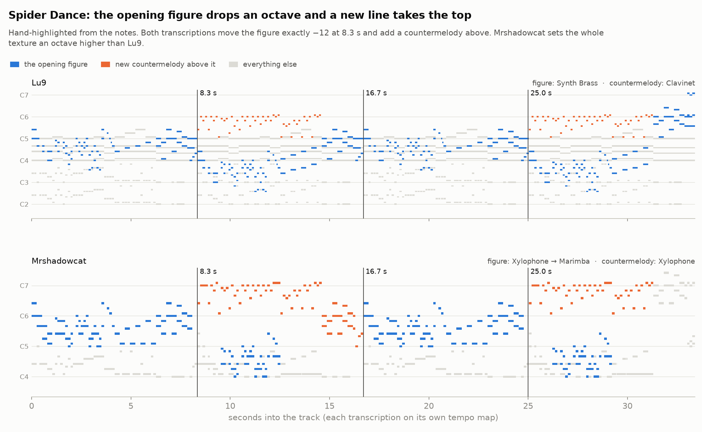

# Same phrase, new octave or colour: does Toby Fox do it?

*2026-10-04 · evidence from fan MIDI transcriptions (58 Undertale files by 24 sequencers,
plus four baseline soundtracks) · everything here is reproducible from the scripts in this folder.*

## Verdict

**The claim holds, with three corrections.**

1. **He does it, in recognisable ways.** In **42%** of Undertale tracks at least one phrase comes
   back in a new octave or on a new instrument. The figure is **32–45%** depending on whose
   transcription you trust. Five songs have it corroborated by independent transcribers to within
   about a second. The strongest case is *Megalovania*: three separate transcriptions all lay the riff
   into high strings at 0:16.
2. **It is not his default.** **81%** of phrase returns in Undertale come back *identical*: same
   instrument, same octave. Even in *Megalovania* the 8-bar brass melody at 0:48 repeats literally
   at 1:04. The technique is a structural spice, not a habit.
3. **It is not his signature alone.** Uematsu (*Final Fantasy VI*, 28%) and Pixel (*Cave Story*,
   30%) do it at statistically indistinguishable rates. *EarthBound* (6%) and *Chrono Trigger* (9%)
   do it far less (p < 0.001).
4. **What *is* distinctive is the trade.** Uematsu varies a return by **changing key** (62% of FF6
   tracks); Toby rarely does (26%, p = 0.0007). He varies a phrase by colour and register and keeps
   the key.



| Soundtrack | Composer(s) | Tracks with a returning phrase | …returns in a new octave/instrument | …returns in a new key | Returns that are literal |
|---|---|---|---|---|---|
| **Undertale** | Toby Fox | 31 | **42%** (32–45%) | 26% | 81% |
| Final Fantasy VI | Nobuo Uematsu | 85 | 28% | 62% | 76% |
| Cave Story | Daisuke "Pixel" Amaya | 37 | 30% | 27% | 83% |
| Chrono Trigger | Yasunori Mitsuda et al. | 57 | 9% | 44% | 80% |
| EarthBound | Keiichi Suzuki & Hirokazu Tanaka | 35 | 6% | 31% | 89% |

Fisher exact tests on track counts. New octave/instrument, Toby vs: EarthBound p = 0.0008,
Chrono Trigger p = 0.0005, FF6 p = 0.18, Cave Story p = 0.32. New key, Toby vs FF6 p = 0.0007.

## How he uses it: five moves

Times are approximate, on the transcription's own clock. **(n/n)** = how many independent
transcriptions show it; **(1)** = only one transcription exists or covers that passage.

### 1. Thicken the repeat
The line keeps going and a new colour or octave is laid onto it the next time round. This is the
best-corroborated move.
- *Megalovania* **0:16**: the riff gains a doubling in strings at C5–C6 **(3/3)** — figure 1.
- *Bonetrousle* **0:45, 0:48**: a bright layer joins the violin line **(2/2)**. Lu9 hears it in
  unison (vibraphone), Jay Reichard an octave up (piccolo) — figure 3.
- *Battle Against a True Hero* **≈2:13–2:28**: a new layer joins the melody on its repeat **(2/2)**.
  One transcriber hears violin in unison, the other glockenspiel an octave up.
- *Ruins* **0:47**: strings join the flute in unison **(2/2)** — figure 2.
- *Spider Dance* **0:58**: the melody returns with a lower-octave colour under or instead of it **(2/2)**.
- *ASGORE* ≈2:16, flute joins the piano (1). *Hopes and Dreams* ≈1:04, overdriven guitar joins
  the strings (1).

### 2. Relay
The same line, in the same register, handed to a new instrument.
- *Ruins* **0:26**: piano → flute **(2/2)**. The two transcribers differ only on which General MIDI
  patch stands in for the flute — figure 2.
- *Battle Against a True Hero* ≈1:56: piano → trumpet (1 of 2; the other doesn't show it).
- *Bonetrousle* ≈0:26: lead synth → calliope (1 of 2; the other hears no change).

### 3. Octave answer
A figure answered by itself an octave away, back and forth every few bars, so the same material
becomes a call and its response.
- *Spider Dance* **0:08 / 0:17 / 0:25**: the opening arpeggio drops **exactly an octave** while a new
  line takes the top, then climbs back **(2/2)**. The transcribers place the whole texture an octave
  apart, but both move it by −12 at the same moment — figure 4.
- *Heartache* ≈0:36–0:42 and ≈1:33–1:39: brass/strings and flute trade one phrase an octave apart (1).
- *Song That Might Play When You Fight Sans* ≈1:36–1:52: strings flip between C5 and C4 every two bars (1).
- *CORE* ≈1:01: a piano phrase is answered an octave down (1).

### 4. Second pass up
The theme's next time round sits an octave higher.
- *Heartache* ≈0:18–0:21: the opening theme returns an octave up, and drops back at ≈1:21 (1).
- *ASGORE* ≈1:09: the harp figure moves up an octave (1).

### 5. Strip back
A layer drops out, or the line falls an octave, when a section comes round again. The next build
then has somewhere to go.
- *Megalovania* **≈1:36**: when the riff returns after the middle section it is bare again, with
  the strings gone **(3/3)**.
- *Spider Dance* **≈1:23–1:28**: the high phrase comes back an octave lower and the top glitter drops
  out **(2/2)**.
- *Another Medium*, *Hopes and Dreams*, *Enemy Approaching* (1 each).

**The shape across all 62 change-events (13 songs):**
- **A wave, not a ramp.** 30 events add something (a layer, or a rise) and 27 take something away.
- **Not saved for the first return.** 23 happen when a phrase first returns; 39 come later.
- **Mostly one octave.** When the top line moves, it moves one octave (32) far more often than
  two (4). Any non-octave shift is counted separately, as a key change.






## What the evidence can and can't carry

- **These are fan transcriptions, not Toby's project files.** Each sequencer picked their own
  General MIDI patch for his sounds. What is comparable across transcriptions is *that* the colour
  changed, not *what* it became. That is why figure colour encodes the role, never the patch.
- **Octave placement is the weak spot.** The transcriptions agree on the moment of a change (to
  within about a second; their tempos differ slightly) and usually on its direction. They often
  disagree on the absolute octave: *Spider Dance*'s two transcriptions sit a whole octave apart, and
  *Bonetrousle*'s disagree on unison vs octave. Official audio would settle this; see the next step.
- **The detector is conservative, so the rates are a floor.** It missed Mrshadowcat's *Spider Dance*
  octave drop because the transcriber varied the figure's first bar. Phrases count as the same only
  when ≥ 80% of their notes agree in rhythm at one constant pitch offset.
- **Hardware is a confound.** The SNES baselines worked under 8 voices and 64 KB of sample RAM,
  which makes layering expensive. *Cave Story*, free of that budget, looks like Toby. Part of the
  gap to *EarthBound* and *Chrono Trigger* may be hardware rather than style. Uematsu did it anyway.
- **Deltarune isn't covered.** VGMusic has none. OnlineSequencer's Deltarune sequences mix remixes,
  works in progress and transcriptions, and I couldn't vet or export them cleanly here.
- **No stems.** Official audio couldn't be fetched from this sandbox, so nothing here was
  separated from Toby's own recordings.

## Next step: check against official audio (needs a go-ahead)

Stem separation (Demucs) plus pitch tracking on the official recordings would fix every
"which octave?" disagreement above. Fetching them automatically was blocked in this session: the
free DELTARUNE Chapter 1&2 build on itch.io was refused by the sandbox's safety check, and Bandcamp
sits behind a bot challenge. Two ways forward:
- **Supply the files.** Both games keep their music as `.ogg` files in the install folder, or use
  the soundtrack files you own.
- **Explicitly allow the itch.io download** of the free Chapter 1&2 build.

## For Folio

- **L8 (arrangement)** is where these five moves live: making minutes out of a few bars by changing
  *who* plays a phrase and *where*, not *what* it is. The nearest thing in the page format is
  `mirrors` (one cell pointed at from several places). These moves are what a site would vary:
  voice, tone, octave. A mirror's sites share one voice today. Nothing here asks for a build; L8
  isn't open.
- **An open question in `EAR-NOTES.md`** asks: does the octave feel closer to "again" than a fifth
  does? Seen from the outside, this study is evidence for octave equivalence. Experienced
  transcribers reliably hear "the same phrase" while disagreeing about *which octave* it is in.
  A play-describe-name pass would answer it for the player: a phrase, then its octave
  restatement, then its restatement a fifth away.
- **L7 (SNES parity).** The 8-voice cap is exactly what makes "thicken the repeat" expensive. It is
  rare in EarthBound and Chrono Trigger, and the cap will push the same way.

## Method, sources, reproduction

- **Sources.** [VGMusic.com](https://www.vgmusic.com) fan MIDIs, fetched by `fetch.py` and not
  committed:
  - **Undertale**: 58 files by 24 sequencers. 15 songs have 2–3 independent transcriptions.
  - **Baselines**: EarthBound 110, Final Fantasy III/VI 408, Chrono Trigger 307, Cave Story 64.
  - **Exclusions**: arrangements, live-played (off-grid) files, and duplicate transcriptions. Each
    song is represented by its best-quantised transcription.
- **Cleaning** (`restate.py`): drums and sequencer echo channels (a delayed copy faking a delay
  effect) are removed. The second pass of the game loop that fan MIDIs often append is cut.
- **Phrases** (`form.py`): a window is one instrument's top line over 2 bars. Two windows are the
  same phrase when ≥ 80% of notes line up in rhythm at one constant pitch offset. Matching windows
  chain into a family.
- **Events.** Wherever a family's carriers (instrument + register) change between consecutive
  statements, that's a restatement event. Each is classed as literal, octave, instrument, layer
  added, layer dropped, or new key. Bass-register families are ignored.
- **Corroboration** (`timeline.py`): every transcription of a song is put on one clock in seconds
  and the events are compared.

```
pip install mido numpy scipy matplotlib
python3 fetch.py          # ~950 MIDIs from vgmusic.com into midi/ (git-ignored)
python3 stats.py          # stats_<corpus>.json, ~2 min
python3 significance.py   # the tests above + the 32–45% range
python3 timeline.py       # every multi-transcription song on a seconds clock
python3 figures.py && python3 fig_compare.py
python3 form.py midi/undertale/UT_Ruins_Lu9.mid   # one song's form map
```
